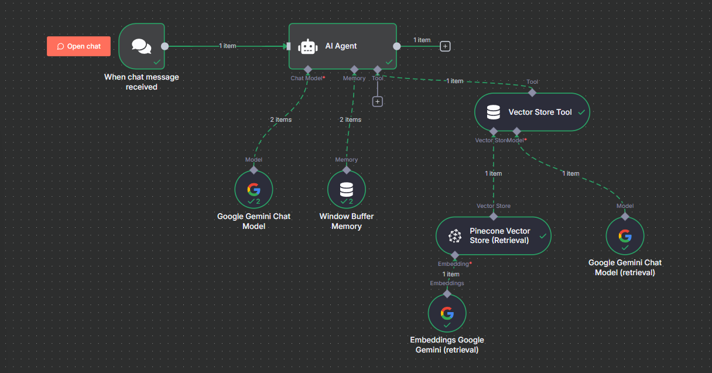

# RAG Chatbot for Company Documents (Google Drive + Gemini + Pinecone)

An AI-powered **Retrieval-Augmented Generation (RAG)** system built with **Google Drive**, **Gemini**, and **Pinecone** using **n8n**.  
This chatbot can read, store, and summarize company (or academic) documents directly from Google Drive — with no manual database setup required.

**Execution Path:**  
Google Drive → Data Loader → Split → Embed → Pinecone → Gemini → Chat Output  

**Sources:** Google Drive PDFs / text documents  
**Outputs:** Gemini-powered chat and summaries using stored Pinecone context  
**Models:** Google Gemini (for text embedding & answering)

---

##  High-Level Flow

1. Upload a file to Google Drive (e.g., `DBMS Unit 1.pdf`).
2. Default Data Loader reads and extracts the file content.
3. Recursive Character Text Splitter breaks the content into manageable chunks.
4. Gemini Embedding Node converts text chunks into vector representations.
5. Pinecone Vector Store stores these vectors for future retrieval.
6. When a user sends a chat query, the AI Agent retrieves the most relevant document chunks from Pinecone.
7. Gemini Model generates a summarized or contextual answer using RAG.

---

##  Architecture

- **Google Drive → File Source**  
- **Default Data Loader →** Reads & converts file content  
- **Recursive Character Text Splitter →** Splits into smaller chunks  
- **Google Gemini Embeddings →** Creates numerical vectors  
- **Pinecone Vector Store →** Stores and retrieves embeddings  
- **Vector Store Tool →** Connects Pinecone to the AI Agent  
- **AI Agent (Gemini) →** Responds with summaries or answers  
- **Chat Trigger →** Takes user queries in real time  

---

##  Node Breakdown

### 1. Google Drive
- **Trigger Type:** File Created  
- **Folder Path:** Linked to user’s company or project Drive  
- **Output:** File metadata to the loader  

### 2. Default Data Loader
- **Operation:** Upload Local File or From Drive  
- **Function:** Converts PDF, DOCX, or TXT into readable text  

### 3. Recursive Character Text Splitter
- **Chunk Size:** 1000  
- **Overlap:** 200  
- **Purpose:** Improves embedding quality for long documents  

### 4. Gemini Embedding Node
- **Model:** `models/text-embedding-004`  
- **Output:** Embedding vectors for each chunk  

### 5. Pinecone Vector Store
- **Index Name:** `company_docs`  
- **Operation:** Insert Documents (for upload flow)  
- **Retrieval:** Finds similar chunks using semantic search  

### 6. AI Agent
- **Model:** Google Gemini 2.5 Flash / Pro  
- **System Message:**  
  > You are a helpful assistant that summarizes and answers questions based on uploaded company documents.  
- **Tool:** Connected to Vector Store Tool  
- **Prompt Source:** Connected Chat Trigger Node  

---

##  Example Queries

| **User Input** | **Response Type** |
|-----------------|------------------|
| “Summarize DBMS Unit 1” | Concise summary using document text |
| “What are the advantages of the database approach?” | Contextual answer based on relevant paragraphs |
| “Explain normalization as described in the file.” | Focused section summary |

---

## Prerequisites

- **n8n or Flowise (latest version)**  
- **Pinecone API key**  
- **Google Drive API credentials**  
- **Google Gemini API key**  
- *(Optional)* **Ngrok** for webhook testing  

---

##  Setup Steps

1. Import or recreate the workflow in **n8n/Flowise**.  
2. Connect all credentials:  
   - Google Drive  
   - Google Gemini  
   - Pinecone  
3. Upload any company or course PDF to Drive.  
4. Execute the workflow once to embed and index data.  
5. Open the chat UI and ask questions like:  
   - “Summarize DBMS Unit 1.”  

---

##  Example Output

**User:** `Summarize DBMS Unit 1`  
**Bot:**  
> DBMS Unit 1 covers the fundamentals of databases — data models, schema, DBMS architecture, advantages of DBMS over file systems, and data abstraction layers. It explains concepts like data independence and the role of the DBMS in ensuring data integrity and consistency.

---

##  Error Handling

- If Pinecone fails → AI Agent responds directly with Gemini’s knowledge.  
- If no document is indexed → chatbot says:  
  > “No file found. Please upload a document first.”  
- Handles PDF parsing errors gracefully.  

---

## Security Notes

- All Drive files are processed via API — no local access required.  
- Pinecone stores **embeddings (vectors)**, not raw text.  
- API keys are stored securely using **n8n/Flowise credentials manager**.  

---

## Future Enhancements

- Add Google Sheets or Notion document support.  
- Implement summarization-on-upload for quick indexing.  
- Add memory or chat history tracking using **Window Buffer Memory**.  

---

**Visual Overview:** 

### 🎥 Project Demo
.mp4)

Click the thumbnail above or [download the video](./Workflow%20(1).mp4) to view the RAG Chatbot in action.

---

### 📄 Project Report
You can read the complete project documentation here:  
👉 [RAG CHATBOT PROJECT.pdf](./RAG%20CHATBOT%20PROJECT.pdf)
